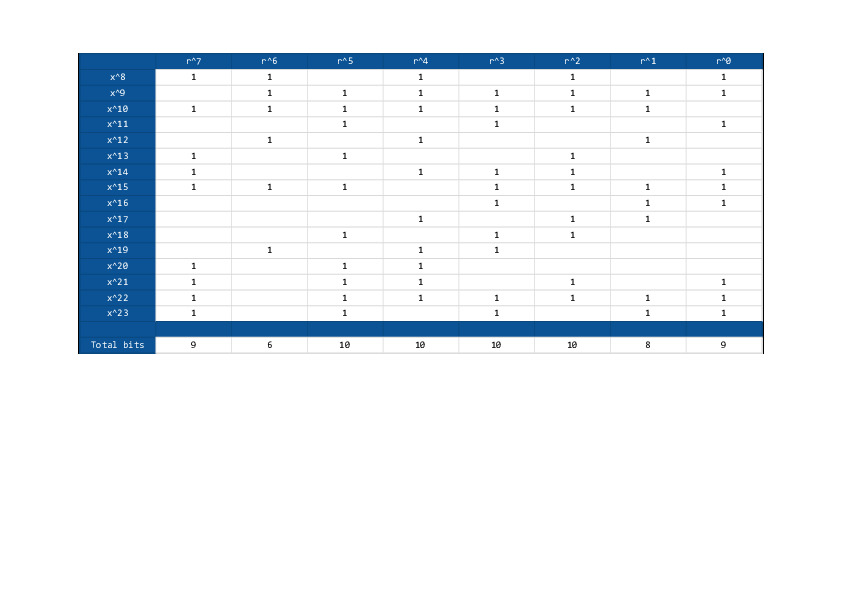
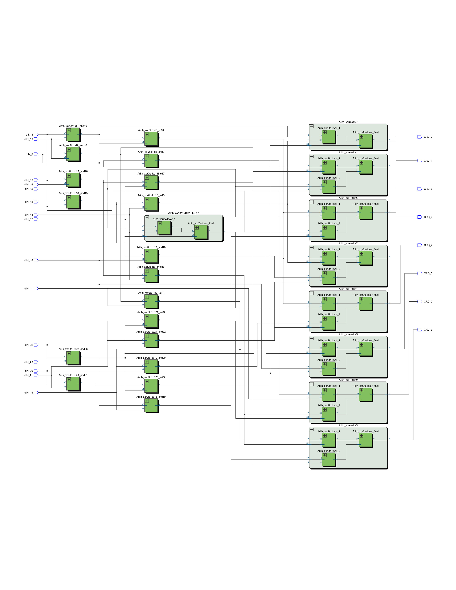
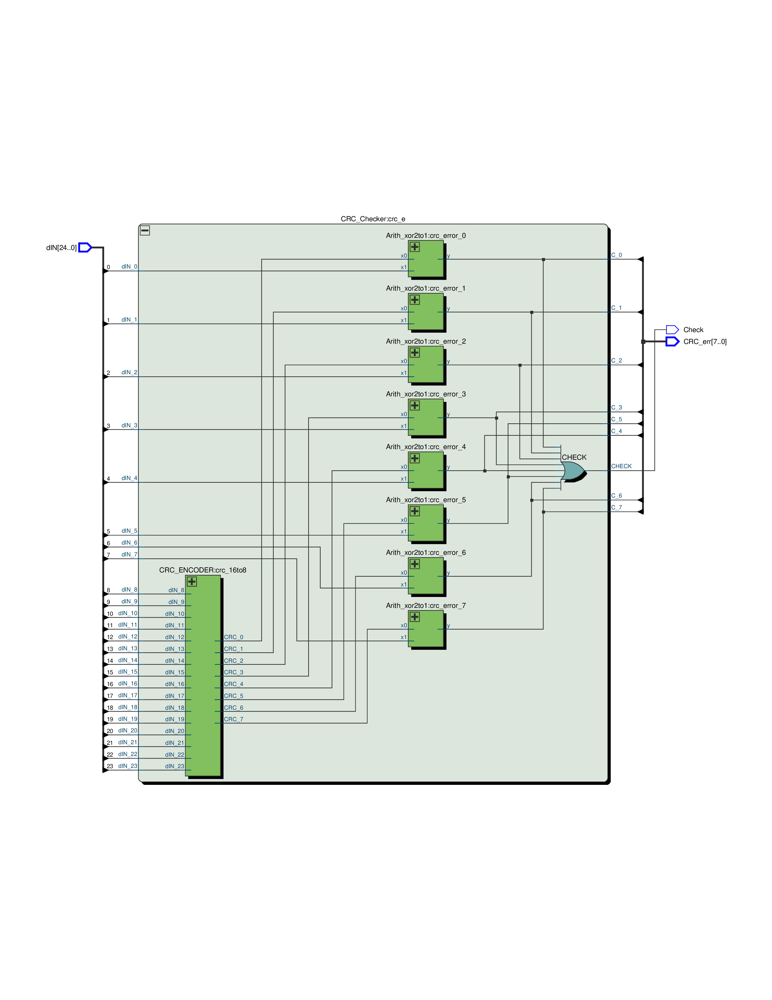

# ACA_CRC
This Project was implemented in the  [Advanced Computer Architecture](http://www.ua.pt/deti/uc/2225) course, lectured at [Aveiro University](https://www.ua.pt) .

## CRC-8
The CRC-Cyclic Redundancy Check is a algorithm, which permits to check if the data of a file, sent over a error-introducing channel, has been corrupted. 
In order to the receiver be able to check whether a file was corrupted or not , the sender must create a value(checksum) and append it to the message.This checksum value, must be obtained by running a function known by the sender and the receiver.

When the message is sent, the receiver removes the checksum value  and uses the function to check whether the checksum value obtained is the same as the one created by the message received. If they are different there has been a error on the message transmission.

### Example:

|        Sender         |        Receiver         |
| --------------------- |:-----------------------:|
| msg-> 00 12           | msg-> 00 12             |
| sent_msg-> 00 12 03   | received_msg-> 00 12 15 |
| original_checksum->03 | received_checksum->15   |

As the checksum values are different there has been a transmission error.

The calculation of an n-bit CRC can be obtained by the follwing expression: 
- CRC=Rem[(M(x)∗x^n)/B(x)] 

M(x) is the message polynomial, B(x) is the generator polynomial and n is the degree of polynomial B(x)

## Assignment

Design a digital circuit, called the encoder, which computes the check string, CRC-8 based,associated with a 16 bit data word. Design also a digital circuit,called the checker, which asserts the correction of the 24 bit CRC-8 coded word.

The assignment entails that some investigation should be made on finding the best possible algorithms for the implementation of the operations.

The Generator Polynomial was :`x⁸+x⁷+x⁶+x⁴+x²+1`

## CRC-Encoder

Knowing that the `REM` operator works like the `MOD` operator for unsigned values of M(x) and B(x). We decided to reimplement the CRC generation operation with this operator:

- CRC=Mod[(M(x)∗x^n)/B(x)] 

M(x) is the message polynomial, B(x) is the generator polynomial and n is the degree of polynomial B(x).

Upon some reading, we found out, that we could use the a simple solution of cascading `Xor gates` , between Message and the Polynomial to calculate the CRC checksum. This solution, would need 8 levels of  8 `Xor gates`(2:1) in paralel, which would spent 64 `Xor gates` to calculate the CRC-8 of a 16 bit message. 

This implementation relied on the bitwise xor of all of the M(x) bits of the CRC bit of the expression, which can be seen in the  remainders table below.

The message bits were represented in this table by :
- M(x)* x^n =X^n+8

The CRC bit, we are calculating is represented in the table by : 
- r^n.

### Example: 
The 2nd most significant bit can be calculated by 

- r⁷ ->x⁸ xor x⁹ xor x⁹ xor x¹⁰ xor x¹² xor x¹⁵ xor x¹⁹

After analysing the generating expressions, we found out that we could reuse some `xor gates` and thus create  a more efficient solution while keeping the expressions true. We implemented a `4 level cascade of xor gates`,consuming 42 xor gates of 2:1.
 

Below we present our solution for the CRC Encoder, generated automatically, after the analysis and synthesis of our VHDL code, runned by  Quartus II software.
 
 
## CRC-Checker 

We can confirm the correctness if the message sent by comparing the CRC Checksum of the sent message with the one calculated from the message received. If they don't match there has been a error in the message transmission.

If we Just want to Check if a error occured we only need to compare every bit of the CRC generated by the message received , with the one received in the message. This means that if we want to check  the correctness a 16-bit message , we need to receive a 24-bit message, were the last 8 bits are the checksum of the 16-bit message , before being sent.

The best way to implement the CRC-Checker is to apply a `bitwise XOR` between the CRC's . This, will give us a precise information about the ocurrence of an error, or not, in every bit of the CRC(Check_err signal). 

### Example:
Check the correctness of the bit 7 of the CRC. 
Sent message CRC-1 : 1
Received message CRC-1 : 0
The bitwise Xor between the two, is 1 . This means that the message had an error in the transmission.

If we just want to check if an error occured(Check signal), without knowing where it ocurred we need to apply a bitwise OR between the results of the previous operation. 

Below, we present our implementation of the CRC Checker, generated automatically after the analysis and synthesis of our VHDL code , runned by  Quartus II software.

 
 
 
